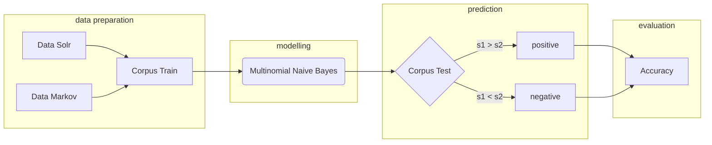

# R&R MIX PRODUCT POLARITY DETECTION PROJECT
LI Chuyuan M1 internship - SementiWeb (06-08/2018)

## Objective
This project aims at using Machine Learning techniques to detect the polarity of different axes of product reviews: odor, price, packaging, texture, etc.

So far, only odor part have been done. However, the modelling is fairly complete, the rest of the axes could re-use the model.

## Requirements
1. Python 3.6
2. Libraries to install:
	- numpy
	- sklearn
    - pymysql

## Roadmap


## Running the program
### Use start.sh (highly recommended)
With test corpus ready in mySQL, hit the bash file (repo Predict) to trigger python script `nbPredit.py`. The codes have been taken care of, users only need to change the configuration at their preference (the present one is used for prediction):

```python
# CONFIGURATION
trainFile='../ModellingCorpus/mediumTrain1.csv'
ngram=2
kFeat=10000
stopWords='english'
interval=1000
limit=100
negTag=True
binary=False
update=False
bernoulli=False
```

Be sure to CHANGE the access to database, as you will see the part *HOST & ACCESS*:
```python
# HOST & ACCESS
host='index-fr.semantiweb.fr'
user='chuyuan'
pw='chuyuan'
db='ratings_and_reviews_ml'
table='customers_avis_smell'
```
After these two steps, users can run bash file.

A trace recording file (trace.txt) will be generated automatically while the script is running. It indicates which step you are in, and show some test results. For example, you will see the trace below in the phrase of prediction:
```
PREDICTING PROCESS...
posts traites 1000
posts traites 2000
posts traites 3000
posts traites 4000
...
(time for prediction = 4.7548 seconds)

Fini
positif posts vs. negatif posts = 13052 vs. 6948
```

A complete run of all the srcipts will go through 2 python scripts and will take around 1 minute with updating (~6 seconds without updating).


### Run .py file
It is also possible to run these python scripts separately:
```
[RawData]
- json_txt.py
[NaiveBayesModel]: 
- naiveBayes.py
- nb2.py
[Predict]
- peeling.py
- nbPredit.py
```

Where all the possible configurations have been clearly indicated, just follow the inscription.