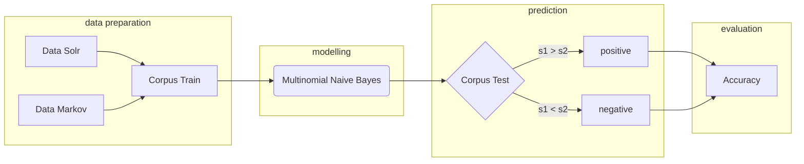

# R&R MIX PRODUCT POLARITY DETECTION PROJECT
LI Chuyuan M1 internship - SementiWeb (06-08/2018)

## Objective
This project aims at using Machine Learning techniques to detect the polarity of different axes of product reviews: odor, price, packaging, texture, etc.

So far, only odor part have been done. However, the modelling is fairly complete, the rest of the axes could re-use the model.

## Requirements
1. Python 3.6
2. Libraries to install:
	- numpy
	- sklearn
    - pymysql
3. Data for train (refer to data prep phase below for Solr requete details)
	- 25k Solr requete result of [*good smell*](http://index-fr.semantiweb.fr:8080/solr/ratings_reviews_final/select?start=0&rows=25000&q=(%22good%20taste%22%20scent%20smell*%20fragrance*%20perfume*)%20NOT%20(%22was%20sent%22%20%22bad%20taste%22%20%22bad%20scent%22%20%22bad%20smell%22%20%22not%20smell%22%20%22doesn%27t%20smell%22%20%22didn%27t%20smell%22%20%22bad%20fragrance%22%20%22bad%20perfume%22%20%22too%20strong%20smell%22%20%22too%20strong%20scent%22%20overwhelming%20overpowering%20%22too%20present%20smell%22%20%22don%27t%20like%20smell%22~2%20%22not%20like%20smell%22~2%20%22don%27t%20like%20scent%22~2%20%22not%20like%20scent%22~2%20%22can%27t%20stand%20the%20smell%22%20%22can%27t%20stand%20the%20scent%22%20%22awful%20scent%22~2%20%22awful%20smell%22~2%20%22strongly%20fragranced%22%20%22chemical%20smell%22%20%22chemical%20scent%22%20%22sent%20me%22%20%22weird%22)&fl=id,content,opinion&indent=on&facet=false&fq=country:(uk%20OR%20usa)&fq=opinion:(n%C3%A9gatif%20OR%20positif)&hl=on&wt=json)
	- 18k Solr requete result of [*bad smell*](http%3A%2F%2Findex-fr.semantiweb.fr%3A8080%2Fsolr%2Fratings_reviews_final%2Fselect%3Fstart%3D0%26rows%3D15002%26q%3D((sent*%20odor*%20flavor*%20flavour*%20smack*%20scent*%20smell*%20perfume*%20fragrance*)%20NOT%20(amazing*%20great*%20wonderful*%20excellent*%20love*%20best*%20pleasant*%20neutral*%20nice*%20good*%20ok*))%26fl%3Did%2Ccontent%2Copinion%26indent%3Don%26fq%3D(stars%3A1.0)%26facet%3Dfalse%26fq%3Dcountry%3A(uk%20OR%20usa)%26fq%3Dopinion%3A(n%C3%A9gatif)%26hl%3Don%26wt%3Djson)
	- 7k auto-generated negative sentences (triples) using [Markov Chains](https://www.agiliq.com/blog/2009/06/generating-pseudo-random-text-with-markov-chains-u/)


## Roadmap


In total 4 phases are presented, scripts and data are included in the folowing 5 reporsitories:
- RawData
- MarkovGenerator
- TrainTestCorpus
- NaiveBayesModel
- Predict
   

### A. Data Preparation Phase
1. Data Solr
	- Reporsitory: RawData
	- 2 files `25k_pos.json` and `18k_neg.json` which stores the raw data from Solr
	- 1 script `json_txt.py` to transform json file to csv
	- 2 files .csv `25k_pos_highlight.csv` and `25k_neg_highlight.csv`
  

2. Markov Chains
   - repository: MarkovGenerator
	- file `seed_neg.txt`, which contains 537 negative sentences, serving as source for generation
	- script `markovgen.py`, read seed file and generate 7000 sentences with an average length of 15 words/sentence


3. Final Corpus Train
   - repository: TrainTestCorpus
   - 2 small corpus (vol=4k) and 2 medium corpus(vol=50k)
   - `mediumTrain1.csv` and `mediumTest1.csv` are used for the training part
   - script for train and test split: `trainTestSplit.py`


### B. Modelling Phase
1. reporsitory: NaiveBayesModel
	- main script `naiveBayes.py`
	- script `nb2.py`: implementation of NB without sklearn lib
	- script `negation_tagging.py`: test adding negation tag
	- use main script to test different combination of arguments
  
2. Naive Bayes Model
   - python library: sklearn, numpy
   - [Theorem](https://en.wikipedia.org/wiki/Bayes%27_theorem)
  $`P(A|B) = \frac{P(B|A) P(A)}{P(B)}`$

3. the prediction is based on the probability of 2 classes: 
   
$sent_x \in
\begin{cases}
	positive & {if P(sent_x | positive) > P(sent_x | negative)}\\negative & otherwise
\end{cases}$
	
4. Feature Selection
   - the selection of features depends on the following criteria:
		- the choice of n-gram: from 1-1 to 1-3
		- volume of n-gram: take all features or top X features (based on [chi-squared test](http://scikit-learn.org/stable/modules/generated/sklearn.feature_selection.chi2.html#sklearn.feature_selection.chi2))
		- frequency or presence: use feature-count vector or binarized vector (present=1, no=0)
		- perserve of stop words
		- perserve of punctuation
	- a grid search is presented and recorded [here](https://docs.google.com/spreadsheets/d/1h0hFaMXubQHRe_z79eKhGRctfgpknq657fMOjkq1jbM/edit#gid=0)

5. Optimization - Negation tag
	- add the tag NOT_ to every word between a negation word ("not", "isn't", etc) and the first punctuation mark following the negation word (refer to [Das and Chen, 2001](http://citeseerx.ist.psu.edu/viewdoc/download?doi=10.1.1.202.6418&rep=rep1&type=pdf))
	- perliminary study indicate that removing the negation tag had a negligible, but yet slightly harmful effect on performance.
	- study result [here](https://docs.google.com/spreadsheets/d/1h0hFaMXubQHRe_z79eKhGRctfgpknq657fMOjkq1jbM/edit#gid=1908435846)

6. **Final Configuration**
      - bigram(1-2)
      - top 10k features
      - perserve punctuation
      - skip stopwords
      - add neg-tag


### C. Prediction Phase
1. reporsitory: Predict
	- 1 file bash `start.sh` to trigger the script `nbPredit.py` and `nbModel.py`
	- 2 script .py
	- 1 script `peeling.py` which enables for detailed analyse for each sentence/expression/word; returns the predict label and scores for postive and negative class.

2. Corpus Predict is accessible [here](http://index-fr.semantiweb.fr:8080/solr/)
   - indexation number **28** customers_avis_smell
   - a corpus of 20k posts, extraced from customers_avis with key words *"smell, odor, fragrance, scent"*
   - /!\ for a more precised prediction, only the sub-parts containing these key words remain, the rest of the post were stripped away (refer to function `stripping ` in `nbPredict.py`)


### D. Evaluation Phase
1. A [Google sheet](https://docs.google.com/spreadsheets/d/11aRmu9L1El3ZEkR01Qagjmr3O4JeUGrf84kbKCsD4cQ/edit#gid=1222429361) is presented with a test of first 30 posts (checkTOP30), and a test of 100 posts (checkNEG50_POS50). 
2. Accuracy Result
 
| 50 Pos  |  50 Neg | All | First 30 |
|:-------:|:----------:|:-------:|:----------:|
|  48 / 50| 27 / 50 |71 / 100|  25 / 30 |
|    96%    |  54%    |  71%  |   **83%**    |


3. In all, the model is better performed when it comes to **positive posts** with an accuracy rate up to **96%**. By contrast, negative posts - due to the complexity of various expressions, the use of negation words, double negation, and so on - are hard to detect the real sentiment.
4. Among the 20k test corpus, aound 80% are positive ones, so the estimated accuray is ~ [78%, 85%]


## Running the program
### Use start.sh (highly recommended)
With test corpus ready in mySQL, hit the bash file (repo Predict) to trigger python script `nbPredit.py`. The codes have been taken care of, users only need to change the configuration at their preference (the present one is used for prediction):

```python
# CONFIGURATION
trainFile='../ModellingCorpus/mediumTrain1.csv'
ngram=2
kFeat=10000
stopWords='english'
interval=1000
limit=100
negTag=True
binary=False
update=False
bernoulli=False
```

Be sure to CHANGE the access to database, as you will see the part *HOST & ACCESS*:
```python
# HOST & ACCESS
host='index-fr.semantiweb.fr'
user='chuyuan'
pw='chuyuan'
db='ratings_and_reviews_ml'
table='customers_avis_smell'
```
After these two steps, users can run bash file.

A trace recording file (trace.txt) will be generated automatically while the script is running. It indicates which step you are in, and show some test results. For example, you will see the trace below in the phrase of prediction:
```
PREDICTING PROCESS...
posts traites 1000
posts traites 2000
posts traites 3000
posts traites 4000
...
(time for prediction = 4.7548 seconds)

Fini
positif posts vs. negatif posts = 13052 vs. 6948
```

A complete run of all the srcipts will go through 2 python scripts and will take around 1 minute with updating (~6 seconds without updating).


### Run .py file
It is also possible to run these python scripts separately:
```
[RawData]
- json_txt.py
[NaiveBayesModel]: 
- naiveBayes.py
- nb2.py
[Predict]
- peeling.py
- nbPredit.py
```

Where all the possible configurations have been clearly indicated, just follow the inscription.


## What's next
1. TRAINING PART: 
   - Polish the training corpus, especially negative posts. By using Solr requests to extract the posts, the quality is not certain. Need to increase the number of TRUE negative posts with more expressions/vocabulary. So that a better model could be constructed.
   - For your information, below are the Solr requete that I used for extraction:
  
  **Solr Requete Detail**

- Corpus: Ratings & Reviews Final
- Configuration **positive**: 
  
		
		- country: uk OR usa
		- opinion: negatif OR positif
		- highlight: on
		- rows: 25000
		- Requete: 
			("good taste" scent smell* fragrance* perfume*) NOT ("was sent" "bad taste" "bad scent" "bad smell" "not smell" "doesn't smell" "didn't smell" "bad fragrance" "bad perfume" "too strong smell" "too strong scent" overwhelming overpowering "too present smell" "don't like smell"~2 "not like smell"~2 "don't like scent"~2 "not like scent"~2 "can't stand the smell" "can't stand the scent" "awful scent"~2 "awful smell"~2 "strongly fragranced" "chemical smell" "chemical scent" "sent me" "weird")
	

- Configuration **negative**:
		
		- country: uk OR usa
		- opinion: negatif
		- highlight: on
		- stars: 1.0
		- rows: 18000
		- requete:
			(sent* odor* flavor* flavour* smack* scent* smell* perfume* fragrance*) NOT (amazing* great* wonderful* excellent* love* best* pleasant* neutral* nice* good* ok*)
		
- Note: the above 2 requets are open for modification, the quality of the posts is the key for trainning the model (if possible, humain annotation is necessary). Due to lack of negative posts and the mediocre quality, I only took 18k from Solr, the rest are auto-generated by Markov Chains with a file of *seed posts*.
  
  
2.  MODELLING PART: 
   - feature selection was the core for modelling, in this study, I used a [univariate feature selection](http://scikit-learn.org/stable/modules/feature_selection.html) method provided by sklearn, which works by selecting the best features based on univariate statistical tests. Another test has been done was *[mutual_info_classif](http://scikit-learn.org/stable/modules/generated/sklearn.feature_selection.mutual_info_classif.html#sklearn.feature_selection.mutual_info_classif)*, but the result was less satisfactory.
   - In order to select the most performative features, I tested the relationship between *feature_nb* and *accuracy* for [bi-grams](https://docs.google.com/spreadsheets/d/1h0hFaMXubQHRe_z79eKhGRctfgpknq657fMOjkq1jbM/edit#gid=374854766) and [tri-grams](https://docs.google.com/spreadsheets/d/1h0hFaMXubQHRe_z79eKhGRctfgpknq657fMOjkq1jbM/edit#gid=238996462). The results are presented in a Google sheet.
   - Another Machine Learning Methods SVM is also known for good sentiment analysis test, worth a try

3. Complete the mix product universe with more axes (working on price)


**Main references**

1. [Speech and Language Processing Chapter 4](https://web.stanford.edu/~jurafsky/slp3/4.pdf)

2. [Speech and Language Processing Chapter 6](https://web.stanford.edu/~jurafsky/slp3/6.pdf)

3. [Thumbs up? Sentiment ClassiØcation using Machine Learning Techniques](http://www.aclweb.org/anthology/W02-1011)


```
Should you have any questions, feel free to contact me =)
lisa27chuyuan@gmail.com
```
